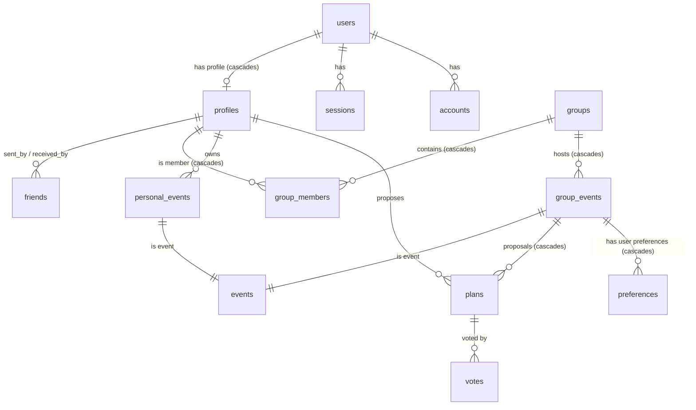

# Baza Shared Agent Memory Bank

This file acts as a shared memory bank for all AI agents working on the Baza project. It provides architectural context, tech stack alignment, and guidelines to ensure consistent development.

---

## 🚀 Project Overview

**Baza** is a collaborative scheduling and planning application that allows users to form groups, propose plans, vote on events, share calendars, and manage group coordinates. The codebase is organized as a monorepo built using `pnpm` workspaces, utilizing TypeScript across the full stack.

---

## 🧱 Architecture & Monorepo Structure

The workspace contains two core applications and two internal shared packages:

```
baza (monorepo root)
├── apps/
│   ├── client/           # Expo React Native mobile client (SDK 55)
│   └── server/           # Fastify backend API
├── packages/
│   ├── db/               # Database schemas, migrations, and Drizzle client
│   └── shared/           # @baza/shared-types (Typebox validators and DTOs)
└── docs/                 # Reference docs, e.g. "baza - endpoints3.pdf" for endpoint details
```

### Core Configuration Files
* **[pnpm-workspace.yaml](file:///c:/Users/rui/local-projects/baza/pnpm-workspace.yaml)**: Defines `apps/*` and `packages/*` as workspaces. Uses `nodeLinker: hoisted` to avoid standard pnpm symlink issues (especially critical for React Native resolution).
* **[package.json](file:///c:/Users/rui/local-projects/baza/package.json)**: Main package entry. Centralizes standard workspace tasks:
  * `dev:server`: Run the Fastify server.
  * `dev:client`: Run the Expo dev server.
  * `db:studio`: Open Drizzle Studio.
  * `db:generate`: Generate database migrations.
  * `db:migrate`: Run database migrations.

---

## 💾 Database Schema (`packages/db`)

Built using **Drizzle ORM** with **PostgreSQL**. The schema represents rich relationships between users, groups, proposed plans, voting, and calendar events. Extensive `{ onDelete: 'cascade' }` cascades are implemented to preserve referential integrity when deleting primary records.

### Relationships Visualization


### Table Definitions (`packages/db/src/schemas/`)
1. **[auth.ts](file:///c:/Users/rui/local-projects/baza/packages/db/src/schemas/auth.ts)**:
   * `users`: Main identity table. Fields: `id` (PK, string), `name`, `email`, `emailVerified`, `image`, `createdAt`, `updatedAt`.
   * `sessions`, `accounts`, `verifications`: Handled automatically by Better-Auth integration.
2. **[profile.ts](file:///c:/Users/rui/local-projects/baza/packages/db/src/schemas/profile.ts)**:
   * `profiles`: Extended user details. **`username` is the Primary Key**. Links to `userId` (referencing `users.id`, with `{ onDelete: 'cascade' }`). Contains `photo`, `description`, and a generic `settings` JSON field.
   * `friends`: Join table. Primary Key is `(sentBy, receivedBy)`. Statuses: `accepted`, `pending`, `rejected`, `blocked`. Custom SQL check ensures dates align with friend status.
3. **[group.ts](file:///c:/Users/rui/local-projects/baza/packages/db/src/schemas/group.ts)**:
   * `groups`: `id` (UUID), `groupname`, `description`, `photo`. Custom SQL regex check validates `groupname` structure.
   * `groupMembers`: Composite Primary Key `(username, groupId)`. Tracks `admin`, `banned` (with custom date check), and `acceptedInvite` statuses. Cascades `{ onDelete: 'cascade' }` on both user deletion (`username`) and group deletion (`groupId`).
4. **[event.ts](file:///c:/Users/rui/local-projects/baza/packages/db/src/schemas/event.ts)**:
   * `events`: Base table containing `id` (UUID), `title`, `description`.
   * `personalEvents`: Links to `events` and `profiles` (`username` PK composite). Tracks calendar parameters: `date` (date), `location` (text), `startTime` (timestamp), `endTime` (timestamp), `allDay` (boolean, default false), `repeat` (every: day, week, month, year, never), `repeatUntil` (date limit), and `public` (boolean). Has constraint checking `startTime < endTime`.
   * `groupEvents`: Links `events` to `groups` (cascading on group deletion). Contains scheduling date ranges (`startDate` / `endDate`), state (`finished` / `unfinished`), `votingEndTime`, and creator profile (`createdBy`).
   * `groupEventsFinal`: Connects `group_events` directly to a winning `plans.id` (cascading on both group and plan deletion).
   * `eventConfirmations`: Composite PK `(groupId, username)` storing confirmation status (cascading on both group and user profile deletion).
5. **[plan.ts](file:///c:/Users/rui/local-projects/baza/packages/db/src/schemas/plan.ts)**:
   * `plans`: Proposed plans for group events. Fields: `groupEventId`, `username` (proposer), `title`, `date`, `startTime`, `endTime`, `allDay` (boolean, default false), `activity`, `location`, budget range (`minBudget` / `maxBudget`). Includes constraints checking `startTime < endTime` and `minBudget < maxBudget`. Cascades on event deletion (`groupEventId` references `groupEvents.id` with `cascade`).
   * `votes`: Joint voting table mapping `planId` and `username`.
6. **[preference.ts](file:///c:/Users/rui/local-projects/baza/packages/db/src/schemas/preference.ts)**:
   * `preferences`: Maps `(username, groupEventId)` to custom planning parameters via JSON `preference` object (with option for `private`). Cascades on event deletion (`groupEventId` references `groupEvents.id` with `cascade`).

---

## ⚡ Backend Services (`apps/server`)

An API server powered by **Fastify**, using **Typebox** for payload validation, **Drizzle ORM** for queries, and **Better-Auth** for authentication.

### Tech Stack & Features
* **Authentication Proxy**: Intercepts requests on `/api/auth/*` and routes them to `better-auth`.
* **API Documentation**: Uses `@fastify/swagger` and `@fastify/swagger-ui` serving Interactive documentation under `/v1/docs`.
* **File Uploads**: Supports multipart parsing via `@fastify/multipart` with localized file system storage (`FSUploadService`).
* **Workspaces Integration**: Direct dependencies on local workspaces `@baza/db` and `@baza/shared-types`.
* **Logging & Rotation**: Uses Fastify's native logger powered by Pino with a `pino-roll` transport. Automatically rotates log files daily or when they reach 10MB in size, keeping a retention limit of 5 files.
* **Linting & Code Quality**: Managed locally via [eslint.config.js](file:///c:/Users/rui/local-projects/baza/apps/server/eslint.config.js) using `typescript-eslint` and [tsconfig.eslint.json](file:///c:/Users/rui/local-projects/baza/apps/server/tsconfig.eslint.json) to cover source, tests, and config files.

### Route Registrations (`apps/server/src/routes/`)
* **[profileRoutes.ts](file:///c:/Users/rui/local-projects/baza/apps/server/src/routes/profileRoutes.ts)** (Prefix: `/v1/restricted/users`):
  * `POST /`: Create/initialize user profile.
  * `GET /me`: Get current user's profile.
  * `GET /:username`: Fetch profile details by username.
  * `PATCH /:username`: Update profile details.
  * `DELETE /:username`: Delete profile.
  * `PATCH /:username/photo`: Upload/update profile photo.
  * `GET /:username/photo`: Get user profile photo.
  * `GET /:username/events`: Retrieve personal calendar events within a `startDate` to `endDate` window (supports expansion of recurring events).
  * `POST /:username/events`: Create a personal calendar event (supports `allDay`, `repeat`, and `repeatUntil`).
  * `GET /:username/events/:idEvent`: Get a specific personal calendar event.
  * `PATCH /:username/events/:idEvent`: Edit a personal event (supports `allDay`, `repeat`, and `repeatUntil`).
  * `DELETE /:username/events/:idEvent`: Delete a personal calendar event.
  * `GET /:username/groups`: List user's groups.
  * `GET /:username/groups/invites`: List pending group invites for user.
  * `PATCH /:username/groups/invites/:groupId`: Accept or reject a group invite.
  * `GET /:username/friends`: List user's friends.
  * `GET /:username/friends/:friendUsername`: Get specific friendship status.
  * `DELETE /:username/friends/:friendUsername`: Remove a friend.
  * `POST /:username/friends/requests`: Send a friend request.
  * `GET /:username/friends/requests`: List incoming friend requests.
  * `GET /:username/friends/requests/sent`: List outgoing friend requests.
  * `PATCH /:username/friends/requests/:senderUsername`: Accept or reject a friend request.
  * `POST /:username/blocks`: Block a user.
  * `DELETE /:username/blocks/:blockedUsername`: Unblock a user.
  * `GET /:username/settings`: Get user settings.
  * `PATCH /:username/settings`: Update user settings.
* **[groupRoutes.ts](file:///c:/Users/rui/local-projects/baza/apps/server/src/routes/groupRoutes.ts)** (Prefix: `/v1/restricted/groups`):
  * `POST /`: Create a new group (automatically adds the creator as an accepted admin member).
  * `GET /:id`: Retrieve group details.
  * `PATCH /:id`: Update group details (e.g. name, description).
  * `DELETE /:id`: Delete a group.
  * `PATCH /:id/photo`: Upload/update group icon photo.
  * `GET /:id/photo`: Retrieve group icon photo.
  * `POST /:id/group-members`: Invite a user to the group.
  * `DELETE /:id/group-members/:username`: Remove/kick a user from the group.
  * `GET /:id/group-members`: List all group members.
  * `PATCH /:id/group-members/:username`: Update a member's role (promote to admin / dismiss admin status).
  * `GET /:id/calendar`: Combined group calendar (retrieves group events and members' personal events with private masking).
  * `POST /:id/events`: Create a new group event.
  * `GET /:id/events`: List group events (optionally filtered by `startDate` and `endDate`).
  * `GET /:id/events/:idevent`: Retrieve details of a specific group event.
  * `PATCH /:id/events/:idevent`: Edit group event parameters.
  * `DELETE /:id/events/:idevent`: Delete a group event.
  * `POST /:id/events/:idevent/resolve-tie`: Resolve a winning plan tie-breaker.
  * `POST /:id/events/:idevent/preferences`: Create or update member's planning preferences (upsert).
  * `GET /:id/events/:idevent/preferences/group`: Get aggregated group preference report.
  * `GET /:id/events/:idevent/preferences`: Retrieve all preferences submitted for the event.
  * `GET /:id/events/:idevent/preferences/:username`: Get a specific member's preference profile.
  * `GET /:id/events/:idevent/plans`: Fetch all proposed plans for the group event.
  * `POST /:id/events/:idevent/plans`: Propose a new plan for the group event (supports `allDay`).
  * `GET /:id/events/:idevent/plans/:idplan`: Fetch a specific proposed plan's details.
  * `PATCH /:id/events/:idevent/plans/:idplan`: Edit a proposed plan's details.
  * `POST /:id/events/:idevent/plans/:idplan/votes`: Submit a vote for a proposed plan.
  * `DELETE /:id/events/:idevent/plans/:idplan/votes`: Revoke/remove a vote.
  * `POST /:id/events/:idevent/confirmations`: Confirm attendance to a finalized group event.
  * `DELETE /:id/events/:idevent/confirmations`: Revoke event confirmation.
  * `GET /:id/events/:idevent/confirmations`: List attendance confirmations.

---

## 📱 Mobile Client (`apps/client`)

A modern mobile application built with **React Native** and **Expo (SDK 55)**.

### Tech Stack & Configuration
* **Router**: Uses **Expo Router** with standard Stack navigation (NativeTabs removed).
* **State & Fetching**: Integrates **Better-Auth Client** (`better-auth/react` with `@better-auth/expo/client` plugin) and **TanStack Query** (`@tanstack/react-query`) for server-state caching and synchronization.
* **Custom Query Hooks**: Wrapper hooks `useAppQuery` (in `src/hooks/useAppQuery.ts`) and `useAppMutation` (in `src/hooks/useAppMutation.ts`) intercept and unwrap monadic `Result<T, StatusError>` responses, automatically throwing any `StatusError` so it integrates natively with React Query error tracking and UI boundaries.
* **API Client & Services**: Custom `apiClient` in `src/services/apiClient.ts` that handles session tokens asynchronously from SecureStore, processes query parameters dynamically, and standardizes error formats. Views/ViewModels consume flat endpoints in `src/services/` (e.g. `userService`, `eventService`) which return `Result<T, StatusError>` structures.
* **Error Boundaries & Reporting**:
  - A global `errorReporter` (in `src/services/errorReporter.ts`) hooks into JavaScript's `PromiseRejectionTracking` to catch uncaught async exceptions and promise rejections.
  - A reusable fallback `ErrorBoundary` UI component (in `src/components/ErrorBoundary.tsx`) is exported from the root `_layout.tsx` to catch rendering crashes via Expo Router's native error routing boundaries.
* **Storage**: Session persistence uses `expo-secure-store`.
* **Google Sign-In**: Native Google Sign-in on Android using Android Credential Manager via `react-native-nitro-google-signin`. The client retrieves the `idToken` and exchanges it for a session via Better-Auth's client `signIn.social` method. Web, iOS, and simulator environments fall back automatically to the standard web-browser redirect flow.
* **Maps & Places Autocomplete**: Location inputs in event scheduling use the custom `GooglePlacesMapInput` component. It uses Google Places API for autocomplete suggestion and coordinates fetching, `expo-maps` for native interactive map display (Apple Maps on iOS, Google Maps on Android), and Google Geocoding API for reverse-lookup on map pin placement. Mapped locations are saved to the database as serialized JSON strings containing coordinates and names, while manually-typed plain text strings are supported with a fallback layout.
* **Fonts & Typography**: Standardized Google Fonts (*Inter* - Regular, Medium, SemiBold, Bold) loaded dynamically using `@expo-google-fonts/inter`. Hiding of the native splash screen is coordinated to delay until both fonts are loaded and session state has resolved.
* **Global Notifications**: Standardized `react-native-toast-message` integration rendered in the root layout, supporting imperative alerts from anywhere (such as within apiClient error catch blocks).
* **Aesthetics & Styling**: Theme-aware custom layouts styled using stylesheet hooks (e.g. `useGlobalStyles`, `useCalendarStyles`, `useCreateEventStyles`, `useProfileStyles`) dynamically pulling variables from `useAppTheme()` which supports light and dark modes (defined in `constants/theme.ts`).
* **Deep Linking**: Defined scheme `"baza"`.
* **Authentication Guard**: Centralized in root [_layout.tsx](file:///c:/Users/rui/local-projects/baza/apps/client/src/app/_layout.tsx) using `useSegments()` and `authClient.useSession()`. Controlled by `EXPO_PUBLIC_BYPASS_AUTH` and strictly guarded by `__DEV__` to prevent accidental production leaks.
* **Architecural Pattern**: Hook-based MVVM model.
  * Presentational Views: `src/app/`
  * ViewModels (Controllers): `src/viewmodels/` named with the suffix `ViewModel` (e.g. `useCalendarViewModel`).

### Route Structure (`apps/client/src/app/`)
* **`auth/`**: Public signup and signin routes (Stack navigation).
  * `login.tsx`: Placeholder login screen.
  * `register.tsx`: Placeholder registration screen.
* **`(protected)/`**: Navigation routing requiring active session.
  * `_layout.tsx`: Renders protected Stack layout; actual session check is deferred to the root layout guard.
  * `index.tsx`: Redirects automatically to `/(protected)/calendar`.
  * `calendar.tsx`: Calendar entry-point/dashboard screen (lists events for the selected date, triggers event creation/edit modals on tap).
  * `profile.tsx`: Profile details screen displaying user stats (friends, events, groups count).
  * `editProfile.tsx`: User profile details editing screen.
  * `friends.tsx`: User's friends list and management screen.
  * `groupList/`: Directory containing the group list and invites navigation flow.
    * `_layout.tsx`: Renders top tabs navigation between Groups and Invites.
    * `groups.tsx`: User groups list screen (fetches user groups, supports pull-to-refresh).
    * `invites.tsx`: Pending group invitations list screen (supports accept/decline actions).
  * `group/`: Nested Group Space and Event Workspace routes (hidden from global tab bar).
    * `[id]/`: Selected group workspace.
      * `_layout.tsx`: Nested bottom tab layout (Calendar, Events, Profile, and hidden event route).
      * `calendar.tsx`: Group Calendar showing member schedules and group planning/resolved spans (using Wix Calendar multi-dot marking).
      * `events.tsx`: Group Events Hub flat list displaying active planning countdowns, tiebreakers, and completed group events.
      * `profile.tsx`: Group Profile details/settings placeholder screen.
      * `event/`: Event Workspace subfolder.
        * `[eventId]/`: Individual event workspace.
          * `_layout.tsx`: Nested top tab layout (Details, Proposals, Preferences).
          * `details.tsx`: Event Details dashboard placeholder screen.
          * `proposals.tsx`: Event Proposals list placeholder screen.
          * `preferences.tsx`: Event Preferences input placeholder screen.
  * `settings.tsx`: App settings screen (e.g. Theme selection via button groups).

---

## 📦 Shared Types (`packages/shared`)

Centralized Typebox validation schemas that ensure strong endpoint and data contracts across both client and server:
* Defines key DTO representations (`userDTO`, `profileDTO`, `groupDTO`, `groupMemberDTO`).
* Declares shared payload bodies (`CreateProfileBody`, `CreateGroupBody`, `EditGroupBody`).
* Houses standard parameters (`UsernameParam`, `SimpleIdParam`).
* Lists uniform Error Enums (`ErrorTypes`) and generic response wrapping constructs (`StatusOK`, `StatusError`).

---

## 🗺️ Completed Roadmap / Endpoints Tasks

All of the remaining route handlers and services specified in [README.md](file:///c:/Users/rui/local-projects/baza/README.md) have been fully implemented on the backend:

### 1. Group Member Role Management
* `[x]` `PATCH /v1/restricted/groups/:id/group-members/:username` (Promote member to group admin status / dismiss admin status)

### 2. Group Events
* `[x]` `POST /v1/restricted/groups/:id/events` (Create a new group event schedule)
* `[x]` `GET /v1/restricted/groups/:id/events` (List all events for a group, optionally filtered by `startDate` / `endDate` query window)
* `[x]` `GET /v1/restricted/groups/:id/events/:idevent` (Fetch details of a specific group event)
* `[x]` `PATCH /v1/restricted/groups/:id/events/:idevent` (Modify group event parameters)
* `[x]` `POST /v1/restricted/groups/:id/events/:idevent/resolve-tie` (Resolve a winning plan tie-breaker)

### 3. Event Planning Preferences
* `[x]` `POST /v1/restricted/groups/:id/events/:idevent/preferences` (Create or update member planning preferences - upsert)
* `[x]` `GET /v1/restricted/groups/:id/events/:idevent/preferences/group` (Retrieve aggregated group preference report)
* `[x]` `GET /v1/restricted/groups/:id/events/:idevent/preferences` (Retrieve all preferences submitted for the event)
* `[x]` `GET /v1/restricted/groups/:id/events/:idevent/preferences/:username` (Get a specific member's preference profile)

### 4. Group Plans & Voting
* `[x]` `GET /v1/restricted/groups/:id/events/:idevent/plans` (Fetch all proposed plans for an event)
* `[x]` `POST /v1/restricted/groups/:id/events/:idevent/plans` (Propose a new plan for the event, supports `allDay`)
* `[x]` `GET /v1/restricted/groups/:id/events/:idevent/plans/:idplan` (Fetch specific plan proposal details)
* `[x]` `PATCH /v1/restricted/groups/:id/events/:idevent/plans/:idplan` (Edit proposed plan details, supports `allDay`)
* `[x]` `POST /v1/restricted/groups/:id/events/:idevent/plans/:idplan/votes` (Submit a vote for a proposed plan)
* `[x]` `DELETE /v1/restricted/groups/:id/events/:idevent/plans/:idplan/votes` (Revoke/remove a vote from a proposed plan)

### 5. Combined Group Calendar
* `[x]` `GET /v1/restricted/groups/:id/calendar` (Retrieve combined group events and members' personal events with private event masking)

---

## 🛠️ Key Workflows

### 1. Database Migrations
When schemas change in `packages/db/src/schemas/`:
```bash
# Generate SQL migration script
pnpm db:generate

# Execute migration on the postgres database
pnpm db:migrate
```

### 2. Upgrading Authentication
To regenerate database schemas conforming to Better-Auth layout changes:
```bash
# Generate fresh database schemas from auth client definitions
pnpm --filter @baza/server generate-auth-schema
```

### 3. Testing & Test Database Isolation
Tests run sequentially against separate test setups:
* **Backend Server Tests**: Configured in `apps/server/vitest.config.ts`. Run sequentially against a separate isolated database (`baza_test`). Handled by a global setup hook in `apps/server/tests/helpers/globalSetup.ts` which automatically creates the test DB and runs migrations.
* **Client Mobile Tests**: Configured in `apps/client/jest.config.js`. Uses `jest-expo` as a preset with `@swc/jest` configured to compile ESM (`.mjs`) files in `node_modules` (e.g., `typebox`). This prevents the variable shadowing and namespace collision issues with Babel presets when importing `@baza/shared-types` in components and services.


---

## 📝 Best Practices & Conventions

1. **Schema DTO Checks**: When writing database operations, convert results back using `Value.Convert(profileDTO, dbRecord)` and check validity using `Value.Check()` before forwarding.
2. **Path Alias Imports**: Use standard workspace mappings:
   * `@/` resolves to local `src/` in individual apps.
   * Workspace imports: `@baza/db`, `@baza/shared-types` should be preferred over relative folders when crossing packages boundaries.
3. **Strict Parameter Validation**: Ensure all fastify route setups provide complete Swagger parameters, description tags, and type definitions utilizing Typebox schemas.
4. **Style Definitions**: Avoid hardcoding hexadecimal or standard base color constants in frontend components. Always pull dynamic variants from the native color context (`Color.android.dynamic.*`).
5. **Pre-database Constraint Checks**: Prior to calling insert or update on tables with database check constraints (e.g. `startTime < endTime` or `minBudget < maxBudget`), validate inputs in the TS/JS service layer first. Return `ErrorTypes.MalformedRequestError` on violation to map to `400 Bad Request` instead of triggering unexpected DB execution failures (500s/403s).
6. **No Temporal DB CHECK Constraints**: Avoid using `CURRENT_TIMESTAMP` or `NOW()` inside database-level check constraints (like `voting_time_check`). Because `CURRENT_TIMESTAMP` is non-deterministic, these constraints will fail during database dumps/restores and block row updates. Implement temporal checks in the TS/JS service layer instead.
7. **Robust Background Schedulers**: Prevent overlapping async tasks by avoiding standard `setInterval`. Implement recursive `setTimeout` callbacks protected by boolean execution locks (`isProcessing`).
8. **Performant Database Filtering**: Filter data in PostgreSQL using Drizzle conditions (`gte`, `lte`, etc.) instead of fetching all records and filtering them in-memory via JavaScript arrays.
9. **Time Suffixing (RFC3339 compatibility)**: When serializing columns mapped to PostgreSQL `TIME` (returned as timezone-less strings like `"HH:MM:SS"`), format them by appending `"Z"` (e.g. `"HH:MM:SSZ"`) prior to validating against TypeBox schemas using `format: "time"`, as AJV format checkers require timezone offset suffixes for validity. Similarly, incoming test payloads should supply times in this suffix-aware format.
10. **Calendar Event Datetime Formatting**: When querying personal calendar events (where `start_time` and `end_time` are stored as `timestamp` in the database), Drizzle returns them as JS `Date` objects. Ensure they are mapped to ISO strings using `.toISOString()` to satisfy the TypeBox schema `format: "date-time"`. Date columns (like `personalEvents.date`) must be formatted as YYYY-MM-DD strings to satisfy `format: "date"`. Always verify that query selects include all required DTO properties (e.g., `createdAt`, `updatedAt`).
11. **API Error Normalization**: When making requests using `apiClient`, the client automatically normalizes non-conforming error responses (e.g., Fastify parameter validation errors, gateway timeouts) into Baza's standard `StatusError` structure. Ensure that view and viewmodel error handlers can safely read `result.error.error.type` and `result.error.error.message` without encountering `undefined` properties.
12. **Select Settings UI**: For settings options (like Theme selection) with a small, fixed list of values, prefer rendering simplified horizontal button groups (capsules) rather than elaborate dropdown selectors to maintain clean layout flows and reduce component complexity.
13. **Preserving Nulls in Shared Types**: When constructing results in services, ensure `null` values are preserved when operations succeed with no payload (e.g., `Ok(null)`). The `Ok` constructor is designed to preserve `null` rather than converting it to `undefined`, which is critical for satisfying Fastify serialization schemas (e.g., `Type.Null()` or `Type.Union([..., Type.Null()])`) and preventing `500 Internal Server Error` serialization failures.
14. **Personal Calendar Layout & Fetching (Approach C)**: The personal calendar (`calendar.tsx`) uses a split layout: Wix's `<Calendar>` component sits on top, and a custom React Native `<FlatList>` with `<EventCard>` items sits at the bottom. This prevents scroll conflicts and optimizes styling via the dynamic `useAppTheme` hook. Dates are queried using a month window dynamically calculated in `useCalendarViewModel.ts` to cover adjacent month overlap grids (padding buffer of 7 days around the visible month).
15. **Drizzle Relational Queries v2 Filter Syntax**: When utilizing the `db.query.<table_name>.findMany` or `findFirst` methods (Relational Query API), the `where` configuration option expects a declarative object structure of type `RelationsFilter` (not a callback function). Construct logical filters using properties like `OR`, `AND`, `NOT`, and field comparison operators (e.g. `{ date: { gte: startDate } }`). Using callback functions will trigger typescript compilation errors because Drizzle's v1.0.0-beta Relational Query API uses this declarative object format.
16. **Event Creation/Editing Modal Consolidation**: The event creation and editing logic is unified in `CreateEventModal.tsx` and driven by `useCreateEventViewModel.ts`. The modal hydrates and validates the form, and manages the edit workflow seamlessly if `eventToEdit` is supplied.
17. **All-Day Event Temporal Normalization**: When `allDay` is set to true (for personal events or group plans), both the client and server force the event boundaries to cover the entire day (start time at `00:00:00`/`00:00:00.000Z` and end time at `23:59:59`/`23:59:59.999Z`), ensuring clean database constraint validations and timezone parity.
18. **Repeat-Until Boundaries**: For repeating events with a set limit, `repeatUntil` (saved in YYYY-MM-DD date format) enforces bounds during expansion, preventing infinite loop hazards. During database queries or local event expansions (via `expandRepeatingEvents`), events are constrained to stop at `repeatUntil`.
19. **Winning Plan Time Normalization**: When serializing `winningPlan` for group events on the server side, format its `startTime` and `endTime` fields by appending `"Z"` if they do not contain it. This ensures they satisfy the `planDTO` `format: "time"` schema verification and avoids `ConversionError` (HTTP 500) failures when fetching events for groups with finalized plans.
20. **Event Workspace Navigation**: To save vertical space and prevent navigation overload, the Event Workspace uses a single screen ([details.tsx](file:///c:/Users/rui/local-projects/baza/apps/client/src/app/(protected)/personal/groupSection/group/[id]/event/[eventId]/details.tsx)) managed by an inline segmented control state instead of a nested Tabs navigator. Sub-views (Details, Proposals, Preferences) are structured as modular components under `src/components/eventWorkspace/` and conditionally rendered.

